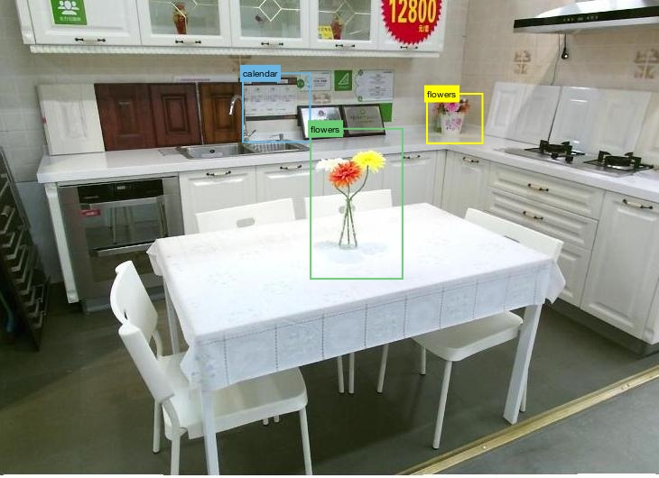
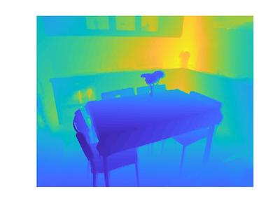
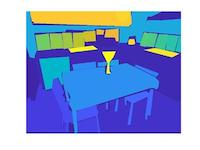

This repository is a forked version of the [refer API](https://github.com/lichengunc/refer). This distribution is compatible with Python3 and contains the new SUNSPOT dataset.

## Abstract 

SUNSPOT is a new referring expression dataset focused on spatial referring expressions. The purpose of this dataset is to aid human robot collaboration in scenes which provide challenges to object detection and localization due to clutter, occlusion, unknown object classes, and multiple instances of the same object class. It also presents a challenging dataset for natural language and the understanding of spatial prepositional phrases in English. Our dataset provides 7,987 referring expressions of 1948 images with an average of 2.60 spatial prepositions per expression. 

For more details about the SUNSPOT dataset, please read our paper [SUN-SPOT: Localizing objects with spatial referring expressions]().

## Example



- The calendar is hanging below the cupboards above the sink
- The calendar is over the sink.
- The flowers in the corner of the room, to the right of the silver plaque.
- The flowers are on the corner of the counters, to the left of the range.
- The flowers are on top of the white table in a clear vase.
- The red, white and yellow flowers sitting in the middle of the table.

Image includes depth channel. Annotations include bounding boxes, instance segmentation, and scene and object labels.

  

## Citation

We provide the refer.bib file for easy citation.

If you used SUNSPOT, please cite both the SUNSPOT paper and the SUNRGBD papers
```
C. Mauceri, M. Palmer, and C. Heckman. SUN-SPOT Localizing objects with spatial referring expressions. In AAAI, 2018.
N. Silberman, D. Hoiem, P. Kohli, and R. Fergus. Indoor segmentation and support inference from rgbd images. In ECCV, 2012.
A. Janoch, S. Karayev, Y. Jia, J. T. Barron, M. Fritz, K. Saenko, and T. Darrell. A category-level 3-d object dataset: Putting the kinect to work. In ICCV Workshop on Consumer Depth Cameras for Computer Vision, 2011.
J. Xiao, A. Owens, and A. Torralba. SUN3D: A database of big spaces reconstructed using SfM and object labels. In ICCV, 2013
```

If you used RefCOCOg, please cite
```
J. Mao, J. Huang, A. Toshev, O. Camburu, A. Yuille, and K. Murphy. Generation and Com-prehension of Unambiguous Object Descriptions. In CVPR, 2016.
```

If you used one of the three datasets, RefClef, RefCOCO and RefCOCO+, that were collected by UNC. Please cite the EMNLP 2014 paper; if you want to compare with recent results, please check the ECCV 2016 paper.

```
Kazemzadeh, Sahar, et al. "ReferItGame: Referring to Objects in Photographs of Natural Scenes." EMNLP 2014.
Yu, Licheng, et al. "Modeling Context in Referring Expressions." ECCV 2016.
```

## Setup

1. Repository contains a submodule for evaluating the results so clone recursively with \
```git clone --recurse-submodules https://github.com/crmauceri/refer_python3.git```
2. Run `make`. It will generate ``_mask.c`` and ``_mask.so`` in ``external/`` folder.
These mask-related codes are copied from the [coco API](https://github.com/pdollar/coco).
4. Prepare Images: [Download the SUNRGBD images](http://rgbd.cs.princeton.edu) and add them into the ``data/images/SUNRGBD`` directory. 
3. Download additional annotations:
If you want to use the refcoco, refcoco+, refcocog, or refclef datasets follow the [download instructions](https://github.com/lichengunc/refer/tree/master/data) from the original repository and add the files to the data folder. The sunspot dataset is included in the repository. 

## Directory structure
After following the setup instructions, you should have the following directory structure

```
refer_python3/
├── data/
    ├── images/
        ├── SUNRGBD/ # Download the SUNRGBD images - http://rgbd.cs.princeton.edu
        ├── mscoco/  # Download the mscoco images - http://cocodataset.org/#download
    ├── sunspot/
        ├── instances.json
        ├── refs(boulder).p
    ├── refclef/     # https://github.com/lichengunc/refer/tree/master/data (optional)
    ├── refcoco/     # https://github.com/lichengunc/refer/tree/master/data (optional)
    ├── refcocog/    # https://github.com/lichengunc/refer/tree/master/data  (optional)
    ├── refcoco+/    # https://github.com/lichengunc/refer/tree/master/data (optional)
├── external/   # segmentation mask encoding/decoding from cocoAPI
├── nlg-eval/   # machine translation metrics for evaluating generated expressions
├── setup.py    # supports `pip install -e .` installation
├── refer.py    # the class that loads the dataset
├── evaluate.py # compares dataset groundtruth to another set of referring expressions
├── pyReferDemo.ipynb # jupyter notebook to view examples and dataset statistics
```                

## How to use

The "refer.py" is able to load all 4 datasets from the original repository [refer api](https://github.com/lichengunc/refer) as well as the new SUNRGBD dataset. 

```python
# locate your own data_root, and choose the dataset_splitBy you want to use
refer = REFER(data_root, dataset='sunspot',  splitBy='boulder') # The new dataset!


# Other datasets
refer = REFER(data_root, dataset='refclef',  splitBy='unc')
refer = REFER(data_root, dataset='refclef',  splitBy='berkeley') # 2 train and 1 test images missed
refer = REFER(data_root, dataset='refcoco',  splitBy='unc')
refer = REFER(data_root, dataset='refcoco',  splitBy='google')
refer = REFER(data_root, dataset='refcoco+', splitBy='unc')
refer = REFER(data_root, dataset='refcocog', splitBy='google')   # test split not released yet
refer = REFER(data_root, dataset='refcocog', splitBy='umd')      # Recommended, including train/val/test
```

If you have jupyter, `pyReferDemo.ipynb` is an easy way to view some of the dataset examples and statistics.

